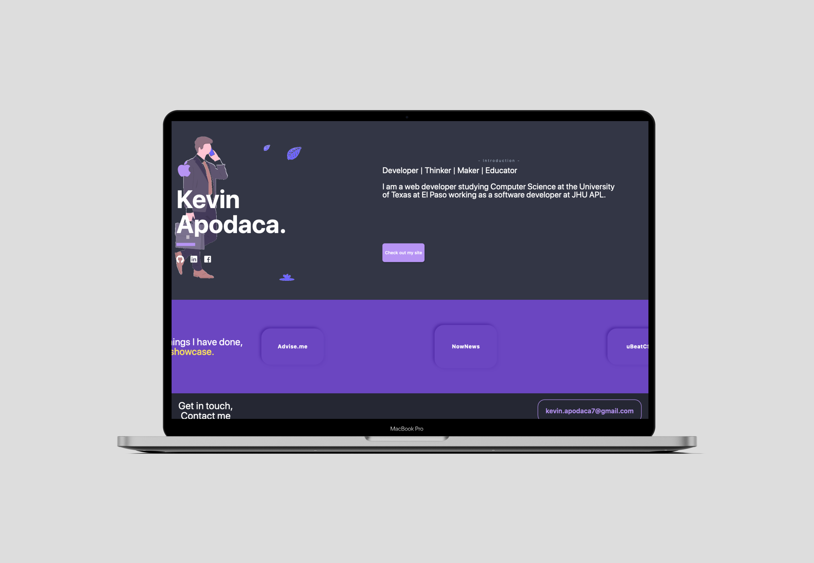

<h1 align="center"> Flutter Portfolio </h1>  

  

  A web portfolio website built with flutter

## Introduction

This is a app to get started with Flutter for web and see its current development stage.

  

## Responsive Design

I tried to build responsive layout using flutter components. It seems to be workable.
